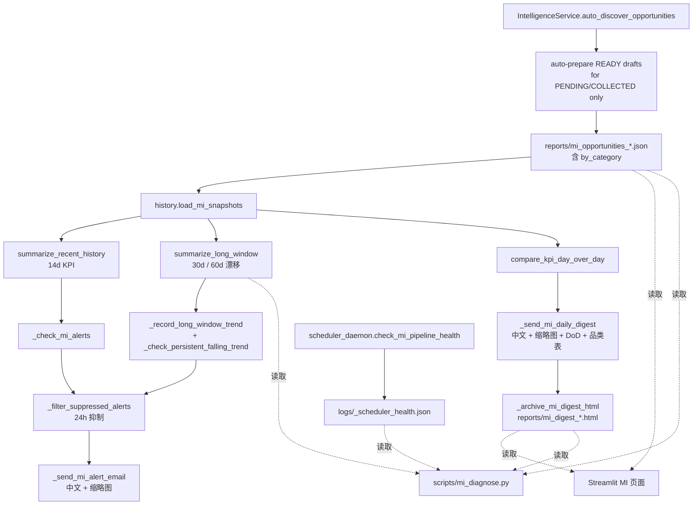

# Dajian Listing Tool Architecture

## 目标

这个仓库不是单一脚本，而是一套围绕大建 / GigaCloud 商品运营的本地自动化系统。

当前主链路分成 7 段：

1. 采集供应商商品数据
2. 生成 READY 草稿
3. 审计并发布草稿到 eBay
4. 维护已刊登链接
5. 运行 CRO 转化率闭环
6. 运行 Market Intelligence 流水线
7. 输出报表、告警、邮件和调度健康状态

## 系统边界

### 外部系统

- GigaCloud / GigaB2B 页面：原始商品页面
- Dajian Open API：价格、库存、尺寸、重量等供应商数据
- eBay OAuth / Inventory / Offer / Trading / Taxonomy API：刊登与维护
- Terapeak / Marketplace Insights / Browse：市场研究与机会发现数据源
- Qwen API：标题、描述、属性生成
- SMTP：日报、告警和运营通知

### 本地系统

- 浏览器扩展：负责页面采集
- FastAPI 服务：负责数据接收、API 发布入口、OAuth、状态接口
- Streamlit UI：负责人机操作和 MI 可视化
- 调度守护进程：负责定时编排 `daily_tasks.py`、CRO 队列消费、detect-only live audit、MI 自检、ad restore、健康检查和促销轮换
- 批处理脚本：负责 READY 审计、改价、健康检查、CRO 执行与反馈、修复和 MI 诊断
- CRO 服务层：负责诊断、入队、bandit、threshold feedback、发布门控和运维治理闭环
- SQLite：负责产品状态、OAuth token 和部分插件数据
- `logs/` 与 `reports/`：负责运行期产物、报表、健康状态和 MI 归档

## 运行时拓扑

```text
Chrome Extension
    |
    v
POST /api/collect
    |
    v
server.py -----------------------> ebay_collection.db
    |                                      |
    |                                      v
    |                             qwen_optimizer.py
    |                                      |
    |                                      v
    |                        src/utils/listing_quality_gate.py
    |                                      |
    |                                      v
    |                               status = READY
    |                                      |
    |                                      v
    |                      scripts/audit_fix_ready_drafts.py
    |                                      |
    |                                      v
    +---- POST /api/publish/{sku} ----> batch_publish.py ----> eBay APIs
                                               |
                                               v
                                        status = PUBLISHED
                                               |
                  -----------------------------------------------------------------
                  |                |                 |              |         |      |
                  v                v                 v              v         v      v
           inventory sync     smart repricing   health check   live audit      MI   taxonomy repair

daily_tasks.py
    |
    +--> analyze collected products
    +--> inventory sync / repricing / audit / summary email
    +--> run_cro_diagnose()
    +--> run_mi_snapshot()

scheduler_daemon.py
    |
    +--> 09:30 daily_tasks.py
    +--> 09:40 ad restore
    +--> 10:05 MI self-check
    +--> 11:30 detect-only live listing audit
    +--> 09:45 blacklist cleanup
    +--> 09:50 guard anomaly
    +--> 09:55 CRO effect-audit gate
    +--> 10:00 CRO consume
    +--> 10:15 CRO image refresh
    +--> 10:20 CRO fill specifics
    +--> 10:30 CRO sentinel
    +--> Sun 03:00 CRO ops snapshot + DB DR drill
    +--> every 2h analyze-only
    +--> 20:00 health check
    +--> every 6h promotion rotate
```

## 生命周期视角

### 1. 采集阶段

入口：

- `extension/content.js`
- `server.py` -> `POST /api/collect`

输出：

- 写入 `collected_products`
- 状态进入 `PENDING` / `COLLECTED`

原则：

- 尽量保留原始供应商数据，不在采集阶段做强业务判断
- 图片、视频、标题、描述和页面规格信息都应尽量保真
- 图片 URL 在采集阶段必须原样保留，包括 GigaB2B 的签名 query 参数

### 2. 分析阶段

入口：

- `daily_tasks.py` -> `analyze_collected_products()`
- `batch_analyze.py`
- `qwen_optimizer.py`

输出：

- `optimization`
- `cost_breakdown`
- `suggested_price`
- 状态进入 `READY`

原则：

- 标题和描述由 AI 生成，但尺寸 / 重量必须尽量来自可信数据
- 不要为了生成完整草稿而伪造关键规格
- AI 输出不是发布安全边界；进入 `READY` 前必须经过 `src/utils/listing_quality_gate.py`
- 质量门会规范化产品画像、类目、item specifics、测量值、描述测量文本和已知乱码
- 质量门无法修复的 blocking issue 应让分析失败或保留为 unresolved，不要静默放行

### 3. READY 审计阶段

入口：

- `scripts/audit_fix_ready_drafts.py`

输出：

- 修复后的 `optimization`
- `logs/ready_draft_audit_*.json`

原则：

- `Item Length` / `Item Width` / `Item Height` 必须真实存在且非占位
- `Item Weight` 不统一强制，但如果存在必须可信
- 类目更换必须受 plausibility 约束
- `scripts/audit_fix_ready_drafts.py` 会复用 listing quality gate，并把无法修复的问题写入 `quality_gate` unresolved
- 常见阻断包括类目与产品族不匹配、非家具 item specifics、乱码、单图或明显少图、description 缺少测量数字

### 4. 发布阶段

入口：

- `batch_publish.py`
- `server.py` -> `POST /api/publish/{sku}`

输出：

- eBay inventory item
- eBay offer
- eBay listing
- 本地状态进入 `PUBLISHED`

原则：

- 必须先 dry-run 再 live publish
- 标题进入 eBay 前必须走统一 title sanitizer，不能直接 `[:80]`
- `packageWeightAndSize` 使用包装尺寸和包装重量
- 不能用占位值伪造 `Item Weight`
- 图片 URL 清洗只能删除已知处理参数，例如 `x-oss-process`
- 不得删除 GigaB2B 签名参数 `x-cc` / `x-cu` / `x-ct` / `x-cs`
- 发布或 revise inventory 后必须回读 eBay Inventory `product.imageUrls`
- `batch_publish.py` 在 dry-run 和 live publish 之前再次执行 listing quality gate；dry-run 通过才说明当前本地草稿达到发布前质量要求
- 统一标题边界现在由 `src/utils/title_sanitizer.normalize_listing_title_for_ebay()` 负责，避免 live title 尾部出现截断残片

### 5. 上线后维护阶段

入口：

- `src/plugins/inventory_sync/sync_service.py`
- `scripts/batch_smart_reprice.py`
- `scripts/sales_health_check.py`
- `scripts/audit_fix_active_listings.py`
- `scripts/repair_published_taxonomy.py`
- `src/plugins/active_listing_optimizer/daily_optimize.py`

原则：

- 价格写回本地 DB 前必须验证 live eBay 结果
- live audit 发现的问题必须优先基于 live inventory/offer snapshot 修复，不能只依赖本地 `optimization`
- `11:30` 调度任务当前运行 `scripts/audit_fix_active_listings.py --live --email`，它负责检测和发报告，不负责自动修整个 live corpus
- 标题、features 等 inventory product 改动后，需要 republish 对应 offer，确保 live listing 吃到 revise
- 已刊登类目修复要先补 inventory specifics，再改 live offer
- 不要把历史错误类目当成默认可信来源
- 已刊登链接如果线上只剩 1 张图，但本地 `collected_products.images` 有多张，优先判断为 publish / revise 阶段图片 URL 问题
- 只修复 `ACTIVE` offer；非 ACTIVE 记录先保留为审计结果，避免误改历史或下架链接
- 定时标题优化默认停用，只有显式设置 `ENABLE_SCHEDULED_TITLE_OPTIMIZATION=1` 才允许恢复
- 如果同日新 publish 的 listing 立刻出现在 live audit 报告里，优先判断为 publish-time gate 与 live-audit 规则仍有漂移，而不是简单视为“报告重复”

### 6. CRO 闭环阶段

入口：

- `daily_tasks.run_cro_diagnose()`
- `src/services/conversion_diagnoser.py`
- `src/services/cro_daily_runner.py`
- `scripts/cro_sentinel.py`
- `scripts/cro_effect_audit.py`
- `scripts/cro_image_refresh.py`
- `scripts/cro_fill_specifics.py`
- `scripts/cro_promote.py`
- `scripts/cro_delist.py`
- `scripts/cro_ops_snapshot.py`
- `src/services/cro_ops_control_plane.py`

输出：

- `cro_snapshots` / `logs/cro_action_queue.jsonl`
- 动作消费结果
- Sentinel 告警与 threshold feedback 输入
- 周期性 promote / rollback / delist 候选
- `logs/cro_ops_snapshot.json` / `logs/cro_weekly_improvement.md`

原则：

- 诊断和执行解耦，`09:30` 先生成队列，`10:00-10:30` 再逐步消费。
- 不绕过现有发布、改价、图片和 specifics 安全边界。
- `cro_delist` 仍是人工确认型流程，不自动下架。
- S131-S140 运维治理模块通过 `cro_ops_control_plane` 汇总成只读 ops 快照；它可以做 DB DR drill，但不能发布、下架、改价或 promote。

### 7. Market Intelligence 阶段

入口：

- `daily_tasks.run_mi_snapshot()`
- `scheduler_daemon.task_mi_self_check()`
- `scripts/mi_diagnose.py`
- `src/web/pages/market_intelligence.py`

输出：

- 每日机会快照
- MI 命中的 `PENDING` / `COLLECTED` SKU 自动生成本地 `READY` 草稿
- Streamlit 手动发掘路径与 `run_mi_snapshot()` 共用同一套自动起草逻辑
- MI 告警邮件
- 每日 digest 邮件与 HTML 归档
- 长周期 trend 状态
- 自检结果与诊断输出

原则：

- MI 当前是 `daily_tasks.py` 默认全量工作负载的一部分，没有独立 `--mi-only` CLI
- MI 自动起草只推进到本地 `READY`，不会直接 publish 到 eBay
- 手动点击 Streamlit 的 `🚀 开始发掘爆品` 也会触发同样的本地自动起草，但仍然不会自动刊登
- MI 告警和 digest 邮件使用中文内容，并带商品缩略图
- 自检必须把缺失快照、缺失 digest、缺失或空的 trend 历史、trend 过旧等情况视为失败

## 模块分层

### 入口层

- `server.py`
- `app.py`
- `daily_tasks.py`
- `scheduler_daemon.py`
- `scheduler_watchdog.py`
- `batch_publish.py`
- `qwen_optimizer.py`

### 服务层

- `src/services/ebay_auth.py`
- `src/services/ebay_category_matcher.py`
- `src/services/ebay_publisher.py`
- `src/services/pricing_engine.py`
- `src/services/ebay_discount_service.py`
- `src/services/cro_*.py`

### 客户端层

- `src/clients/dajian_client.py`
- `src/clients/real_ebay_client.py`
- `src/clients/ebay_trading_client.py`

`real_ebay_client.clean_image_url()` 是图片安全边界：它可以去掉图片处理参数，但必须保留供应商签名参数，防止 eBay live 图片列表退化成单图。

### 自动化脚本层

- `scripts/` 下的 READY 审计、active 审计、taxonomy 修复、改价、健康检查、ad restore 和 MI 诊断

### 插件层

- `src/plugins/inventory_sync/`
- `src/plugins/active_listing_optimizer/`
- `src/plugins/terapeak_research/`

### UI 层

- `extension/`
- `src/web/`
- `app.py`

### 持久化层

- `src/db/`
- `ebay_collection.db`
- `ebay_tokens.db`
- `logs/`
- `reports/`
- 插件自有 `.db` 文件

### 共享校验工具

- `src/utils/listing_quality_gate.py`：生成链接统一质量门，负责产品画像、草稿规范化和 blocking issue 输出
- `src/utils/publish_validation.py`：READY 审计与 live publish 共用的测量 / 类目基础校验逻辑
- `src/utils/publish_autofix.py` / `src/utils/publish_aspect_completion.py`：发布侧占位值清洗、单值字段规范化和 required aspects 补全

## 主调度关系

当前要区分两个层次：

- `scheduler_daemon.py`：自动调度入口
- `daily_tasks.py`：日常工作负载入口

`daily_tasks.py` 的真实职责包括：

- 分析 `COLLECTED` 商品
- 库存同步
- 幽灵缺货恢复
- 智能调价
- listing audit
- 销售健康检查
- MI snapshot / alert / digest
- 每日汇总邮件

这意味着多数独立脚本虽然仍可单独运行，但已经不再是“首选主入口”。

## MI 流水线

每日由 `daily_tasks.run_mi_snapshot()` 串起，构成完整的“发现 -> 落盘 -> 趋势 -> 告警 -> 日报 -> 归档 -> UI -> 自检 / 诊断”闭环。



### MI 关键文件

| 层 | 文件 | 职责 |
|---|---|---|
| 服务 | `src/plugins/terapeak_research/intelligence_service.py` | 机会发现核心 |
| 计算 | `src/plugins/terapeak_research/aggregation.py` | 品类聚合 + `mi_categories.json` 配置加载 |
| 历史 | `src/plugins/terapeak_research/history.py` | 快照读写 / KPI / 长周期 / DoD / 品类时序 |
| 调度 | `daily_tasks.run_mi_snapshot` | MI 每日入口 |
| 自检 | `scheduler_daemon.check_mi_pipeline_health` | 检查 snapshot / digest / trend / 状态文件 |
| 诊断 | `scripts/mi_diagnose.py` | 面向操作者的文本 / JSON 诊断输出 |
| 邮件 | `daily_tasks._send_mi_alert_email` / `_send_mi_daily_digest` | 中文邮件 + 缩略图 |
| UI | `src/web/pages/market_intelligence.py` | KPI、趋势、品类钻取、digest 浏览 |
| 配置 | `mi_categories.json` | MI 品类规则 |
| 状态 | `reports/mi_blacklist.json` / `mi_alerts_state.json` / `mi_long_window_history.json` | 流水线持久状态 |
| 归档 | `reports/mi_opportunities_*.json` / `mi_digest_*.html` | 快照与日报 |

### MI 可观测产物

- 邮件：日报每日 1 封，异常告警 24 小时内同类型不重复
- 文件：快照 30 天保留、digest 3 天保留、长周期 trend 14 条保留
- 日志：`logs/_scheduler_health.json` 记录最近一次 MI 自检
- UI：Streamlit MI 页面实时读取最新快照和 digest；Dashboard 会对 MI 自动起草的 READY 草稿显示来源标记，无需重启 FastAPI

## 安全扩展点

适合新增逻辑的位置：

- 新 API 集成：`src/clients/`
- 新业务规则：`src/services/`
- 新的日常运维能力：`scripts/` 或 `src/plugins/`
- 新 UI 页面：`src/web/pages/`

不建议随意扩展的位置：

- 直接在 `server.py` 堆积更多业务逻辑
- 在多个脚本里复制同一套类目、测量或 MI 规则
- 绕过 `PricingEngine`、`EbayCategoryMatcher`、`EbayPublisher` 直接写死规则

## 横切约束

- JSON 字段更新必须调用 `flag_modified()`
- token 来源是 `ebay_tokens.db`，不是环境变量里的 access token
- `Item Weight` 不应被占位文本伪造
- 桌类标题不能被 decor / planter 类目错误 canonicalize
- live price 未验证前，不允许把本地价格状态记为成功
- `server.py` 和 `batch_publish.py` 的发布前校验应共享同一套规则，不要再分叉维护
- MI 状态文件缺失或空内容不是“中性状态”，而是需要修复的失败信号

## 推荐阅读顺序

1. `README.md`
2. `docs/USAGE.md`
3. `docs/TESTING.md`
4. `agent.md`
5. `skill.md`
